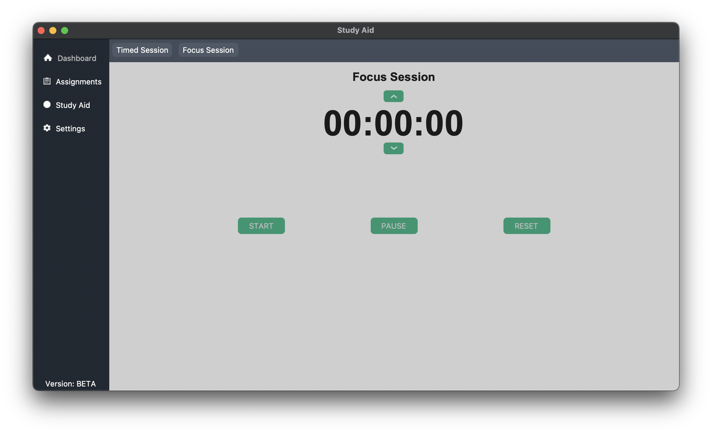

# Study Aid
An open-source application used to track assignments and overall improve productivity.
> The project is open-source in order to allow people to customize their own application and meet their own needs. You can simply download and use it or customize it to fit your needs!

## Table of Contents
> Coming Soon . .

## Examples

> This is an example of a few assignments via the Assignments tab.

> This is an example of a timed session which runs a stopwatch.

> This is an example of a focus session which allows the user to be focused until their break comes up.
