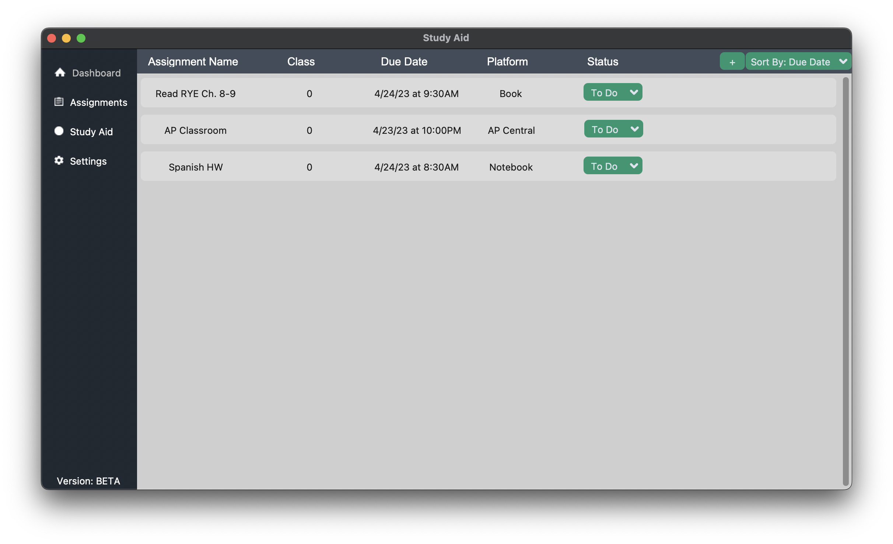
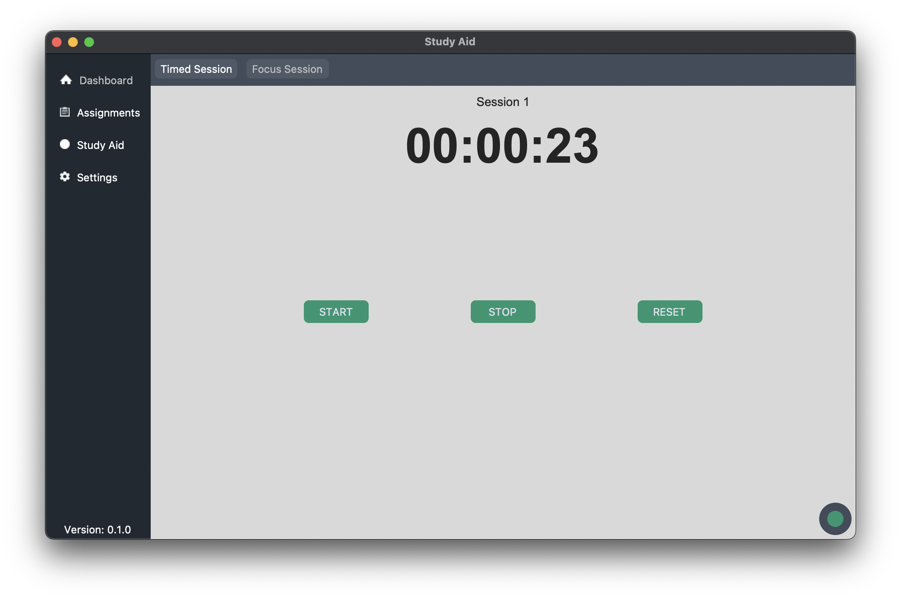
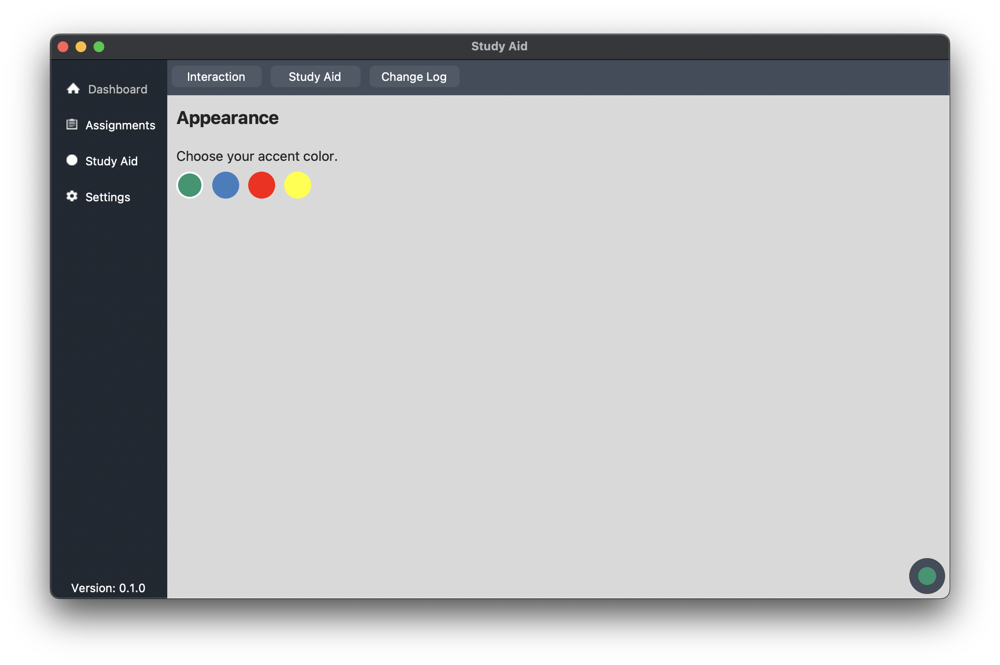

  <picture>
    
  </picture>

# Study Aid
An open-source application used to track assignments and overall improve productivity with features such as a stopwatch to time your studies, study sessions with built-in breaks that will alert the user when a break should be taken, and much more to come!
> The project is open-source in order to allow users to customize the application to meet their own needs. Users can simply download and use it or customize it to fit their needs.

## Libraries Used
- [CustomTKinter](https://pypi.org/project/customtkinter/0.3/)
- [tkcalendar](https://pypi.org/project/tkcalendar/)
- [Pillow](https://pypi.org/project/Pillow/)

## Examples *(macOS)*

