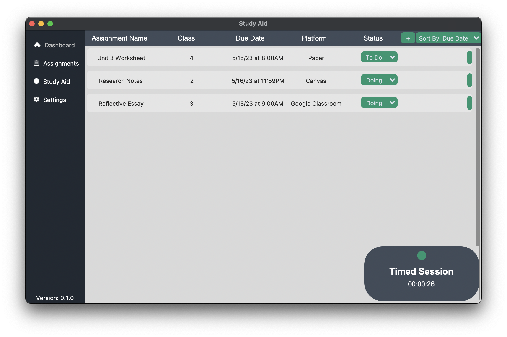

# Study Aid
An open-source application used to track assignments and overall improve productivity with feautures such as a stopwatch to time your studies, study sessions with built in breaks that will alert the user when a break should be taken, and much more to come!
> The project is open-source in order to allow people to customize their own application and meet their own needs. You can simply download and use it or customize it to fit your needs!

## Table of Contents
> Coming Soon . .

## Examples

| _An example of assignments on macOS via the Assignments tab._

| _A timed session on macOS, similar to a stopwatch._

| _A focus session on macOS. A user will be notified when a break should be taken._
